# 구해줘 홈즈

서울 14반 이동현, 박영서

## 구현 내용

### 1) 동별 , 아파트별 실거래가 조회 기능 

(동별 실거래가 조회 기능)

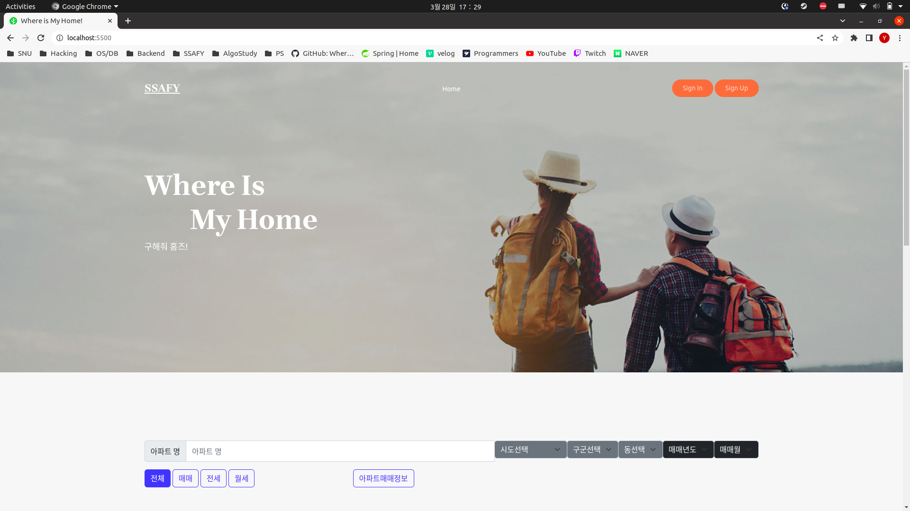

서버로부터 받은 지역 정보를 ajax로 비동기 처리, select - option에 넣음

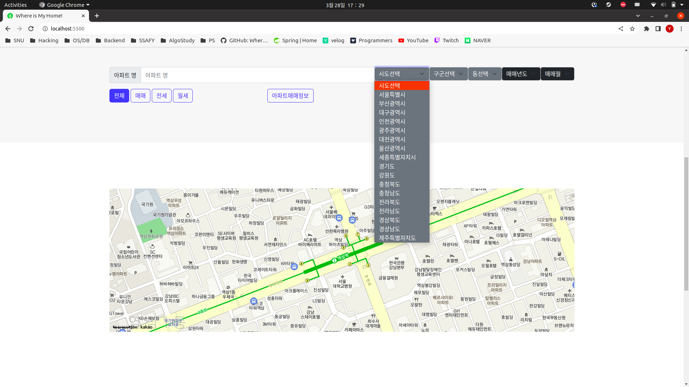

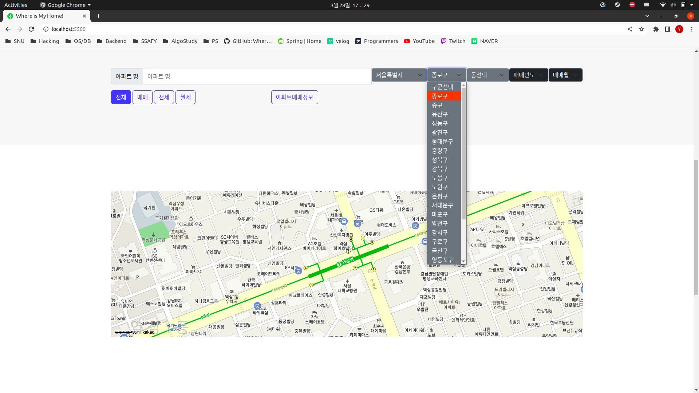

시도 -> 구군 -> 동 -> 연도 -> 월 순으로 필터링

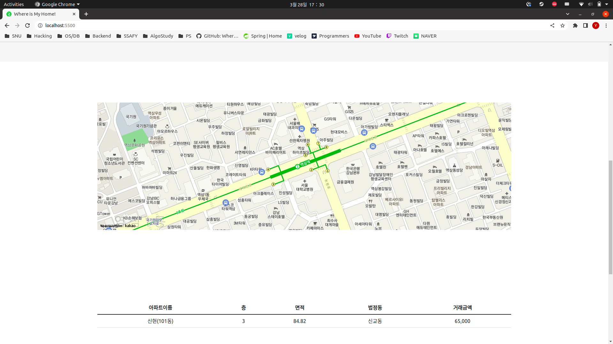

조회기능

### 2) 회원정보 등록, 수정, 삭제, 조회 페이지

(회원 등록 페이지)

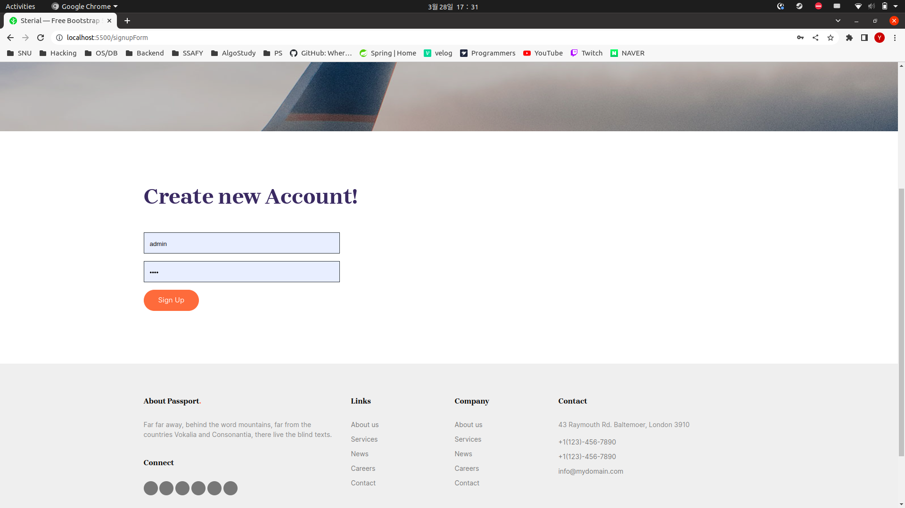

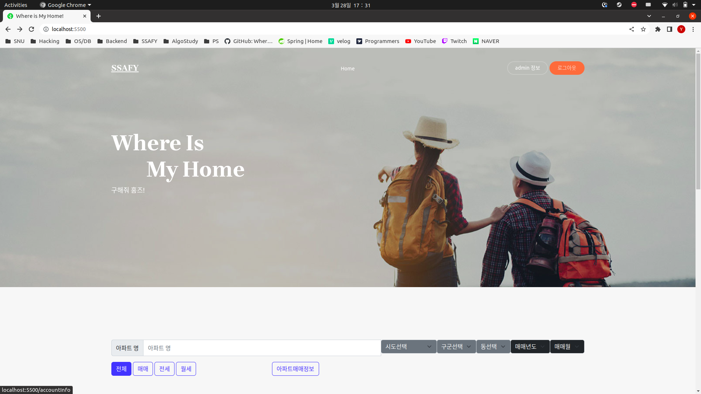

회원 등록 시 로그인이 된 채로 홈으로 리다이렉트

로그인 시 오른쪽 위 버튼이 로그아웃 버튼으로 바뀌고, 클릭 시 로그아웃 

(회원 정보 수정/삭제/검색 및 비밀 번호 찾기  페이지)

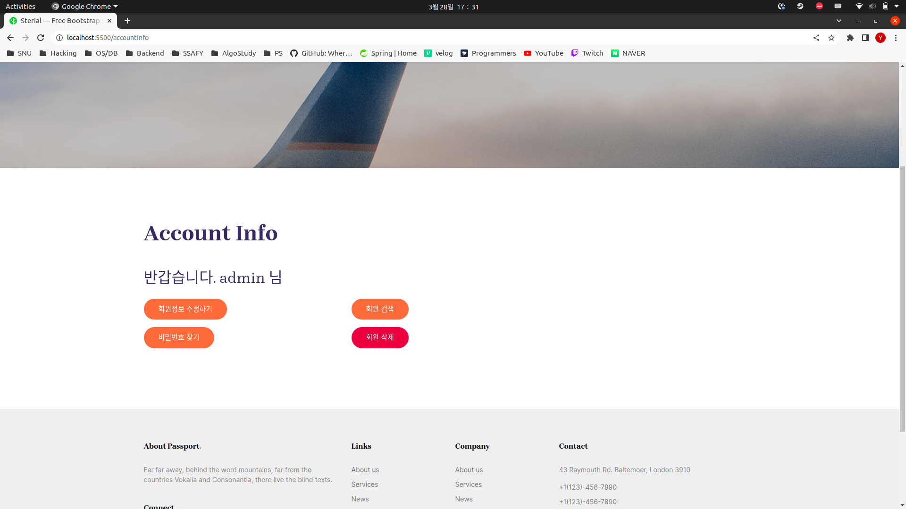

(회원 정보 수정 페이지)

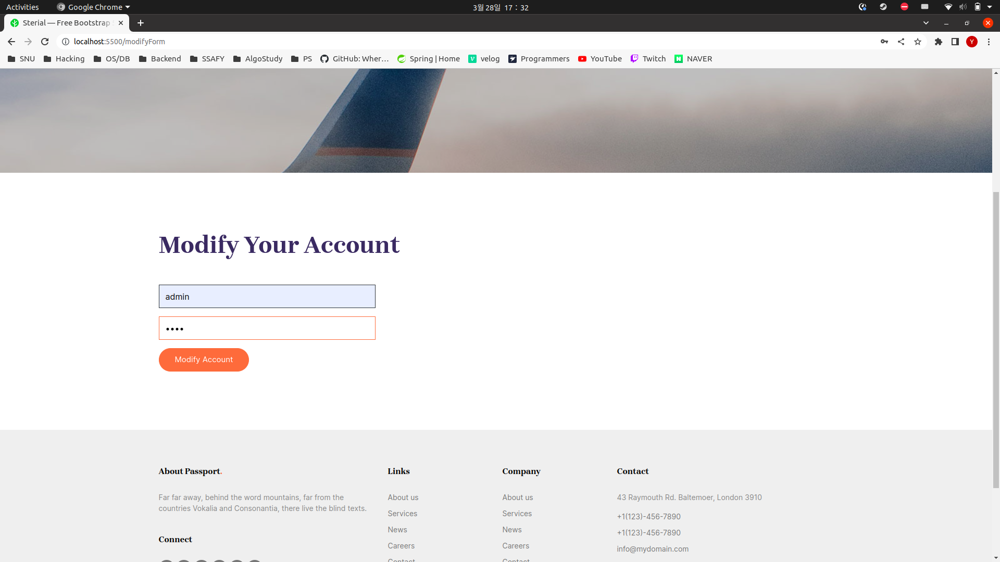

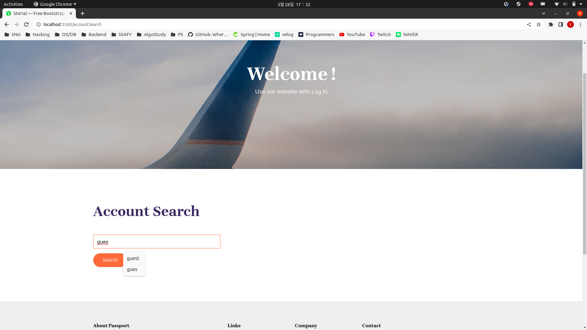

(회원 검색 페이지)

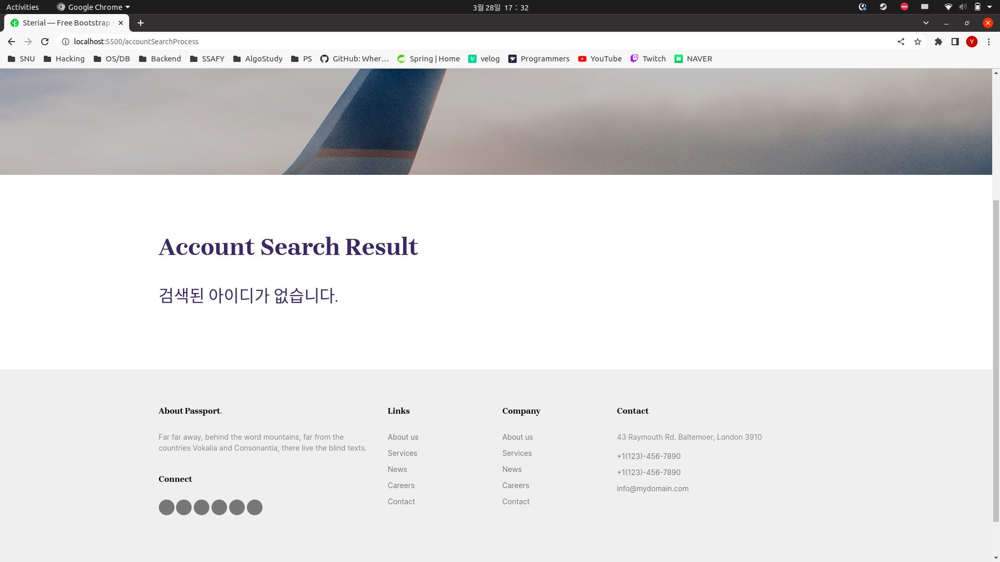

(검색된 회원이 없는 경우)

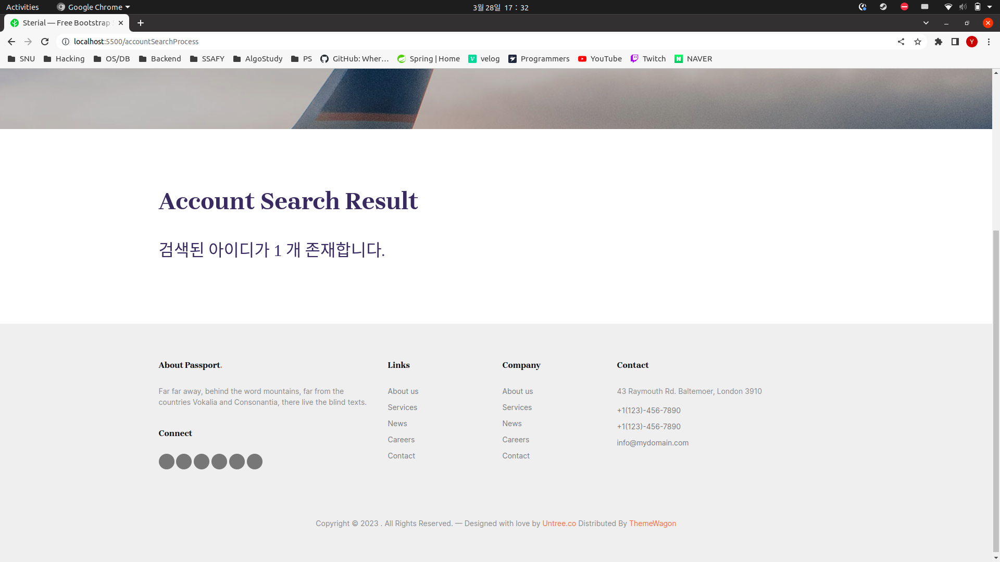

(검색된 회원이 있는 경우)

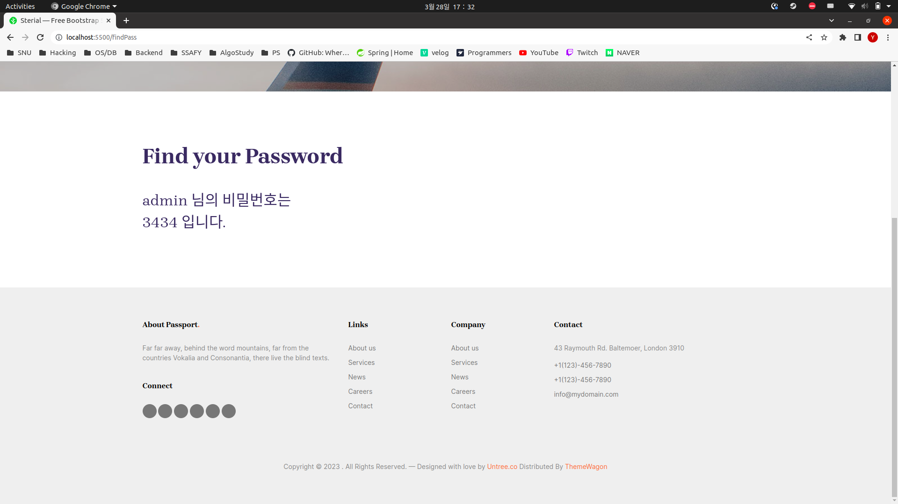

비밀 번호 찾기 

회원 삭제 시 DB에서 회원 정보를 제거하고 로그아웃. 홈으로 리다이렉트

