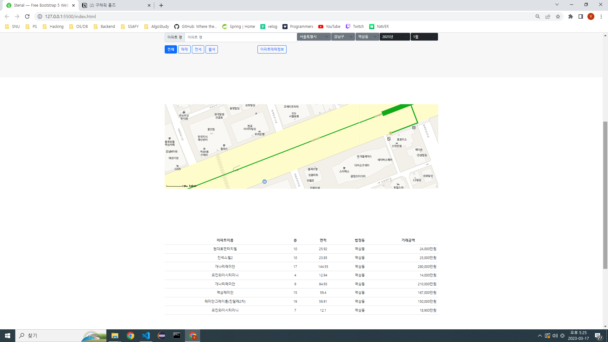

# 구해줘 홈즈

서울 14반 이동현, 박영서

## 구현 내용

### 1) 동별 , 아파트별 실거래가 조회 기능 (필수 기능 1-3)

(동별 실거래가 조회 기능)

(검색할 내용이 포함된 아파트만을 조회)

### 2) 회원정보 등록, 수정, 삭제, 조회 페이지

(회원 등록 페이지)

(회원 등록 실패)

 

(회원 정보 수정 페이지 / 회원 정보 삭제 페이지/ 로그아웃)

(로그인 페이지)

(로그인 실패 시)

(로그인 성공 시)

